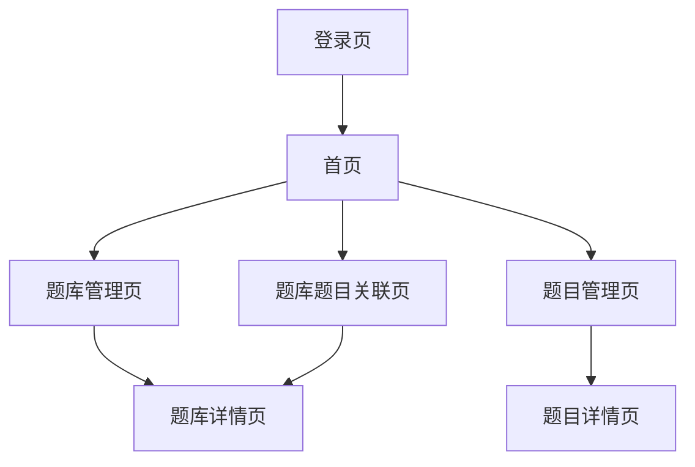

## 1. 产品概览

本产品是一个题库管理系统，用于管理题库、题目以及题库与题目的关联关系。
- 解决用户对题库和题目进行高效管理的需求，支持管理员对题库和题目进行增删改查操作。
- 产品的目标是提供一个直观、易用的界面，方便用户管理和维护题库资源。

## 2. 核心功能

### 2.1 用户角色

| 角色 | 注册方式 | 核心权限 |
|------|----------|----------|
| 管理员 | 后台注册 | 可管理所有题库和题目，包括创建、编辑、删除操作 |
| 普通用户 | 注册或微信登录 | 可查看题库和题目，但不能进行编辑操作 |

### 2.2 功能模块

我们的题库管理系统包含以下主要页面：
1. **登录页**：用户登录和注册功能。
2. **首页**：展示题库列表和题目列表。
3. **题库管理页**：对题库进行增删改查操作。
4. **题目管理页**：对题目进行增删改查操作。
5. **题库题目关联页**：管理题库与题目的关联关系。

### 2.3 页面详情

| 页面名称 | 模块名称 | 功能描述 |
|----------|----------|----------|
| 登录页 | 用户登录 | 提供用户名和密码登录功能，支持微信登录 |
| 登录页 | 用户注册 | 提供用户注册功能，包括账号、密码输入和确认 |
| 首页 | 题库列表 | 展示所有题库，支持分页和搜索 |
| 首页 | 题目列表 | 展示所有题目，支持分页和搜索 |
| 题库管理页 | 题库创建 | 创建新的题库，包括填写题库名称、描述等信息 |
| 题库管理页 | 题库编辑 | 编辑现有题库的信息 |
| 题库管理页 | 题库删除 | 删除指定的题库 |
| 题库管理页 | 题库详情 | 查看题库的详细信息，包括关联的题目列表 |
| 题目管理页 | 题目创建 | 创建新的题目，包括填写题目内容、选项、答案等信息 |
| 题目管理页 | 题目编辑 | 编辑现有题目的信息 |
| 题目管理页 | 题目删除 | 删除指定的题目 |
| 题目管理页 | 题目详情 | 查看题目的详细信息 |
| 题库题目关联页 | 添加题目到题库 | 将指定的题目添加到指定的题库 |
| 题库题目关联页 | 从题库移除题目 | 将指定的题目从指定的题库中移除 |
| 题库题目关联页 | 批量操作 | 支持批量添加或移除题目 |

## 3. Core Process

**管理员操作流程：**
1. 登录系统
2. 进入首页，查看题库和题目列表
3. 进入题库管理页，进行题库的增删改查操作
4. 进入题目管理页，进行题目的增删改查操作
5. 进入题库题目关联页，管理题库与题目的关联关系

**普通用户操作流程：**
1. 登录系统
2. 进入首页，查看题库和题目列表
3. 查看题库和题目的详细信息

## 4. 用户接口设计

### 4.1 设计风格

- **主色**：#3498db（蓝色）
- **辅色**：#2ecc71（绿色）
- **按钮风格**：圆角矩形，有 hover 效果
- **字体**：系统默认字体，标题使用 18px，内容使用 14px
- **布局**：响应式布局，左侧为导航栏，右侧为内容区域
- **图标**：使用 Element Plus 图标库

### 4.2 页面设计概览

| 页面名称 | 模块名称 | UI元素 |
|----------|----------|--------|
| 登录页 | 登录表单 | 用户名输入框、密码输入框、登录按钮、注册链接、微信登录按钮 |
| 登录页 | 注册表单 | 用户名输入框、密码输入框、确认密码输入框、注册按钮、登录链接 |
| 首页 | 导航栏 | 系统名称、题库管理、题目管理、题库题目关联、用户信息、退出登录 |
| 首页 | 题库列表 | 表格展示，包含题库名称、描述、创建时间、操作按钮 |
| 首页 | 题目列表 | 表格展示，包含题目内容、类型、难度、操作按钮 |
| 题库管理页 | 题库表单 | 名称输入框、描述输入框、提交按钮、取消按钮 |
| 题目管理页 | 题目表单 | 内容输入框、选项输入框、答案输入框、标签输入框、提交按钮、取消按钮 |
| 题库题目关联页 | 关联操作 | 题库选择器、题目选择器、添加按钮、移除按钮、批量操作按钮 |

### 4.3 自适应

- 支持桌面端和移动端自适应布局
- 在移动端，导航栏会折叠为汉堡菜单
- 表格在移动端会自动调整为卡片式布局
- 确保在不同屏幕尺寸下都能正常显示和操作