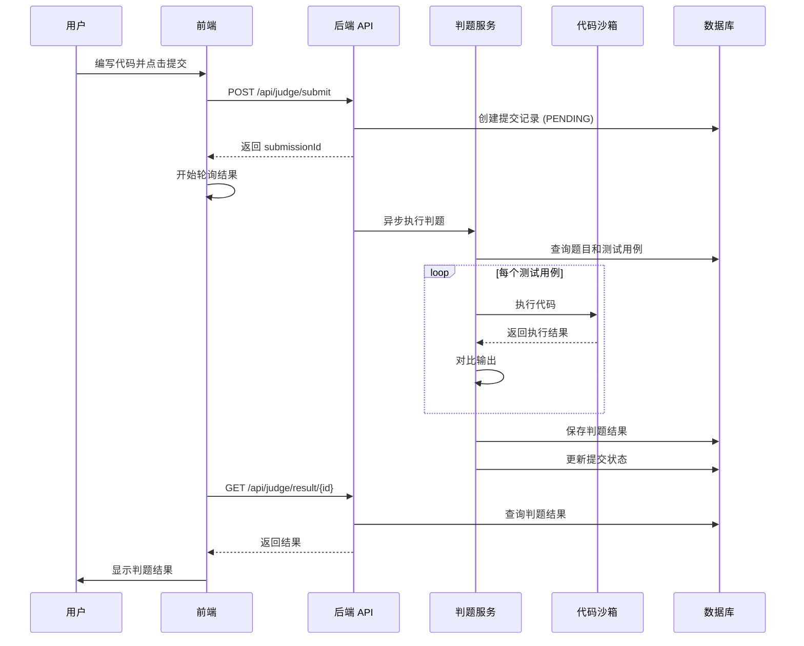

# 在线代码编辑器与自动化判题系统 - 技术文档

## 一、功能概述

本系统实现了完整的在线代码编辑器和自动化判题功能，支持多语言代码编写、提交、编译、运行和自动评测。

### 核心功能
- **在线代码编辑器**：基于 Monaco Editor，支持语法高亮、代码补全
- **多语言支持**：Java、Python、C++、JavaScript
- **自动化判题**：支持 ACM 模式，自动对比输入输出
- **异步判题**：提交后异步处理，实时轮询结果
- **测试用例管理**：支持示例测试用例和隐藏测试用例

## 二、核心架构

### 2.1 系统架构图

```
┌─────────────┐      ┌──────────────┐      ┌─────────────┐
│   前端页面   │─────>│  Backend API  │─────>│  JudgeService│
│ Monaco Editor│      │  Controller  │      │             │
└─────────────┘      └──────────────┘      └──────┬──────┘
                                                   │
                     ┌─────────────────────────────┼─────────────────────────────┐
                     │                             │                             │
              ┌──────▼──────┐            ┌────────▼────────┐           ┌────────▼────────┐
              │  Database   │            │  CodeSandbox    │           │   Test Cases    │
              │  (MySQL)    │            │  (Local/Docker) │           │   (Storage)     │
              └─────────────┘            └─────────────────┘           └─────────────────┘
```

### 2.2 判题流程图



## 三、数据库设计

### 3.1 核心表结构

#### submission - 代码提交表
| 字段名 | 类型 | 说明 |
|-------|------|------|
| id | BIGINT | 主键 |
| questionId | BIGINT | 题目 ID |
| userId | BIGINT | 用户 ID |
| languageCode | VARCHAR | 编程语言代码 |
| code | TEXT | 提交的代码 |
| status | VARCHAR | 状态 (PENDING/JUDGING/ACCEPTED/WA/TLE/MLE/RE/CE) |
| executionTime | INT | 执行时间 (ms) |
| executionMemory | INT | 执行内存 (KB) |
| passedTestCase | INT | 通过的测试用例数 |
| totalTestCase | INT | 总测试用例数 |
| createTime | DATETIME | 提交时间 |

#### judge_result - 判题结果详情表
| 字段名 | 类型 | 说明 |
|-------|------|------|
| id | BIGINT | 主键 |
| submissionId | BIGINT | 提交 ID |
| verdict | VARCHAR | 判题结果 |
| executionTime | INT | 执行时间 |
| executionMemory | INT | 执行内存 |
| testCaseResults | TEXT | 各测试用例结果 (JSON) |
| errorMessage | TEXT | 错误信息 |
| judgeTime | DATETIME | 判题时间 |

#### test_case - 测试用例表
| 字段名 | 类型 | 说明 |
|-------|------|------|
| id | BIGINT | 主键 |
| questionId | BIGINT | 题目 ID |
| input | TEXT | 输入样例 |
| output | TEXT | 输出样例 |
| isExample | TINYINT | 是否为示例 (0-隐藏，1-示例) |
| score | INT | 分值 |

#### programming_language - 编程语言表
| 字段名 | 类型 | 说明 |
|-------|------|------|
| id | BIGINT | 主键 |
| languageName | VARCHAR | 语言名称 |
| languageCode | VARCHAR | 语言代码 |
| compileCommand | VARCHAR | 编译命令 |
| runCommand | VARCHAR | 运行命令 |
| isActive | TINYINT | 是否启用 |

### 3.2 判题状态枚举

```java
public enum JudgeVerdictEnum {
    PENDING("待判题", "PENDING"),
    JUDGING("判题中", "JUDGING"),
    ACCEPTED("答案正确", "ACCEPTED"),
    WRONG_ANSWER("答案错误", "WA"),
    TIME_LIMIT_EXCEEDED("超时", "TLE"),
    MEMORY_LIMIT_EXCEEDED("内存超限", "MLE"),
    RUNTIME_ERROR("运行错误", "RE"),
    COMPILE_ERROR("编译错误", "CE");
}
```

## 四、关键代码说明

### 4.1 代码沙箱接口

**文件路径**: `src/main/java/com/charles/mianti/judge/codesandbox/CodeSandbox.java`

```java
public interface CodeSandbox {
    // 执行代码
    ExecuteResult execute(String languageCode, String code, 
                         String input, int timeLimit, int memoryLimit);
    
    // 编译代码（仅编译型语言）
    CompileResult compile(String languageCode, String code);
}
```

### 4.2 简单代码沙箱实现

**文件路径**: `src/main/java/com/charles/mianti/judge/codesandbox/impl/SimpleCodeSandbox.java`

核心逻辑：
1. 创建临时目录存放代码文件
2. 对于编译型语言（Java/C++），先编译
3. 使用 ProcessBuilder 启动子进程执行代码
4. 捕获标准输出和标准错误
5. 监控执行时间和内存使用
6. 清理临时文件

**安全注意事项**：
- 当前实现为本地执行，生产环境必须使用 Docker 容器隔离
- 已实现基础的危险代码检测（禁止 System.exit、Runtime 等）
- 限制内存和 CPU 时间

### 4.3 判题服务

**文件路径**: `src/main/java/com/charles/mianti/service/impl/JudgeServiceImpl.java`

核心流程：
```java
public void executeJudge(Long submissionId) {
    // 1. 查询提交记录
    Submission submission = submissionMapper.selectById(submissionId);
    
    // 2. 获取题目和测试用例
    Question question = questionService.getById(submission.getQuestionId());
    List<TestCase> testCases = testCaseService.listByQuestionId(questionId);
    
    // 3. 逐个执行测试用例
    for (TestCase tc : testCases) {
        ExecuteResult result = codeSandbox.execute(
            submission.getLanguageCode(),
            submission.getCode(),
            tc.getInput(),
            question.getTimeLimit(),
            question.getMemoryLimit()
        );
        
        // 4. 对比输出结果
        if (result.getVerdict() == ACCEPTED && 
            normalizeOutput(tc.getOutput()).equals(normalizeOutput(result.getOutput()))) {
            passedCount++;
        } else {
            finalVerdict = WA;
            break;
        }
    }
    
    // 5. 保存判题结果
    saveJudgeResult(submission, finalVerdict, ...);
}
```

### 4.4 前端组件

#### CodeEditor 组件
**文件路径**: `mianti-next-frontend/src/components/CodeEditor.vue`

功能特性：
- 集成 Monaco Editor
- 支持语言切换
- 自动加载代码模板
- 运行/提交按钮

#### JudgeResult 组件
**文件路径**: `mianti-next-frontend/src/components/JudgeResult.vue`

功能特性：
- 显示判题结果标签
- 展示执行时间、内存等信息
- 测试用例详情展开
- 错误信息显示

#### QuestionPractice 页面
**文件路径**: `mianti-next-frontend/src/views/practice/QuestionPractice.vue`

功能特性：
- 左右分栏布局（左侧题目，右侧编辑器）
- 实时轮询判题结果
- 示例测试用例展示

## 五、API 接口文档

### 5.1 提交代码

**接口**: `POST /api/judge/submit`

**请求体**:
```json
{
  "questionId": 1,
  "languageCode": "java",
  "code": "public class Main { ... }"
}
```

**响应**:
```json
{
  "code": 0,
  "data": 1234567890,  // submissionId
  "message": "success"
}
```

### 5.2 获取判题结果

**接口**: `GET /api/judge/result/{submissionId}`

**响应**:
```json
{
  "code": 0,
  "data": {
    "submissionId": 1234567890,
    "verdict": "ACCEPTED",
    "verdictText": "答案正确",
    "executionTime": 120,
    "executionMemory": 35840,
    "testCaseScore": 100,
    "totalTestCase": 10,
    "passedTestCase": 10,
    "languageName": "Java",
    "testCaseResults": "[...]",
    "judgeTime": "2026-03-31 12:00:00"
  }
}
```

### 5.3 获取编程语言列表

**接口**: `GET /api/judge/languages`

**响应**:
```json
{
  "code": 0,
  "data": [
    {
      "id": 1,
      "languageName": "Java",
      "languageCode": "java",
      "version": "17"
    },
    {
      "id": 2,
      "languageName": "Python",
      "languageCode": "python",
      "version": "3.9"
    }
  ]
}
```

### 5.4 获取我的提交记录

**接口**: `GET /api/judge/my-submissions`

**参数**:
- questionId: 题目 ID（可选）
- current: 页码
- size: 每页数量

## 六、测试指南

### 6.1 单元测试

运行测试命令：
```bash
cd mianti-next-backend
mvn test -Dtest=CodeSandboxTest
mvn test -Dtest=JudgeServiceTest
```

### 6.2 测试场景

#### 正常提交流程
1. 打开题目练习页面 `/practice/question/{id}`
2. 在编辑器中编写代码
3. 点击"提交答案"
4. 确认提交
5. 等待判题（约 2-10 秒）
6. 查看判题结果

**预期结果**: 显示 AC/WA/TLE 等结果，包含执行时间和内存

#### 编译错误测试
提交有语法错误的代码：
```java
public class Main {
    public static void main(String[] args) {
        int x = ; // 错误
    }
}
```

**预期结果**: 显示 CE (Compile Error)，包含编译器错误信息

#### 超时测试
提交无限循环代码：
```java
public class Main {
    public static void main(String[] args) {
        while(true) {}
    }
}
```

**预期结果**: 显示 TLE (Time Limit Exceeded)

#### 答案错误测试
提交逻辑错误的代码：
```java
// 题目要求 a+b，但代码输出 a-b
System.out.println(a - b);
```

**预期结果**: 显示 WA (Wrong Answer)

### 6.3 端到端测试步骤

1. **准备阶段**
   - 执行 `sql/judge_tables.sql` 创建表结构
   - 启动后端服务
   - 启动前端服务

2. **创建测试题目**
   - 访问题库管理页面
   - 创建一道编程题
   - 添加测试用例（至少 1 个示例，2 个隐藏）

3. **提交代码测试**
   - 访问 `/practice/question/{题目 ID}`
   - 使用以下测试代码：

**Java 正确代码**:
```java
import java.util.Scanner;

public class Main {
    public static void main(String[] args) {
        Scanner scanner = new Scanner(System.in);
        int a = scanner.nextInt();
        int b = scanner.nextInt();
        System.out.println(a + b);
    }
}
```

**Python 正确代码**:
```python
a, b = map(int, input().split())
print(a + b)
```

4. **验证结果**
   - 检查判题结果是否为 ACCEPTED
   - 验证执行时间和内存显示
   - 展开测试用例查看详情

## 七、部署与配置

### 7.1 数据库初始化

```bash
mysql -u root -p < sql/judge_tables.sql
```

### 7.2 环境依赖

**后端要求**:
- JDK 17+
- Maven 3.6+
- MySQL 8.0+
- （可选）Docker - 用于沙箱隔离

**前端要求**:
- Node.js 16+
- npm 或 yarn

### 7.3 配置文件

在 `application.yml` 中确保以下配置：

```yaml
spring:
  datasource:
    url: jdbc:mysql://your-host:3306/mianti
    username: your-username
    password: your-password
  
  redis:
    host: your-redis-host
    port: 6379
```

### 7.4 安全配置（重要）

**生产环境必须使用 Docker 沙箱**：

1. 创建 Docker 镜像（包含 Java、Python、C++ 等运行时）
2. 修改 `SimpleCodeSandbox` 使用 Docker API 执行代码
3. 限制容器资源（CPU、内存、网络）

示例 Docker 执行命令：
```bash
docker run --rm \
  --memory=256m \
  --cpus=1.0 \
  --network=none \
  --pids-limit=50 \
  judge-java:latest \
  java -Xmx256m Main
```

### 7.5 性能优化建议

1. **判题队列**: 引入 RabbitMQ/Kafka 实现异步判题队列
2. **判题机集群**: 多台判题服务器负载均衡
3. **测试用例缓存**: Redis 缓存热点题目的测试用例
4. **结果去重**: 相同代码和题目直接返回历史结果

## 八、已知限制与改进方向

### 8.1 当前限制

1. **安全性**: 当前使用本地执行，存在安全风险
2. **并发能力**: 同步判题，并发度有限
3. **内存测量**: 简化的内存统计，不够精确
4. **题型支持**: 仅支持编程题，不支持选择题、填空题

### 8.2 后续改进

1. **Docker 沙箱**: 实现容器化隔离
2. **消息队列**: 引入 RabbitMQ 实现异步判题
3. **Special Judge**: 支持自定义判题逻辑
4. **OI 赛制**: 支持部分分、亚线性评测
5. **题目类型**: 扩展选择题、填空题、SQL 题
6. **代码查重**: 实现代码相似度检测

## 九、故障排查

### 9.1 常见问题

**问题 1**: 提交后一直显示"判题中"
- 检查后端日志是否有异常
- 验证测试用例是否存在
- 确认可执行文件路径（javac、python3 等）

**问题 2**: 所有提交都返回 RE
- 检查代码沙箱权限
- 验证临时目录写入权限
- 查看具体错误信息

**问题 3**: 前端无法连接后端
- 检查 CORS 配置
- 验证 API 地址是否正确
- 查看浏览器控制台网络请求

### 9.2 日志位置

后端日志默认输出到控制台和生产环境日志文件：
```
logs/mianti-next-backend.log
```

开启 debug 模式查看详细判题过程：
```yaml
logging:
  level:
    com.charles.mianti.service: DEBUG
    com.charles.mianti.judge: DEBUG
```

## 十、总结

本系统成功实现了完整的在线代码编辑器和自动化判题功能，包含：

✅ **已完成功能**:
- Monaco Editor 在线编辑器
- 支持 Java/Python/C++/JavaScript
- 完整的判题流程（提交、编译、运行、对比）
- 异步判题机制
- 测试用例管理
- 判题结果展示
- 提交记录查询

✅ **技术亮点**:
- 标准的 Spring Boot 分层架构
- MyBatis-Plus ORM
- 代码沙箱隔离（基础版）
- 前端组件化设计
- 实时结果轮询

⚠️ **生产注意事项**:
- 必须实现 Docker 沙箱以确保安全
- 建议引入消息队列提升并发能力
- 需要完善监控和告警机制
- 建议实现反作弊检测

---

**文档版本**: v1.0  
**更新日期**: 2026-03-31  
**作者**: Charles  
**联系方式**: [技术支持]
